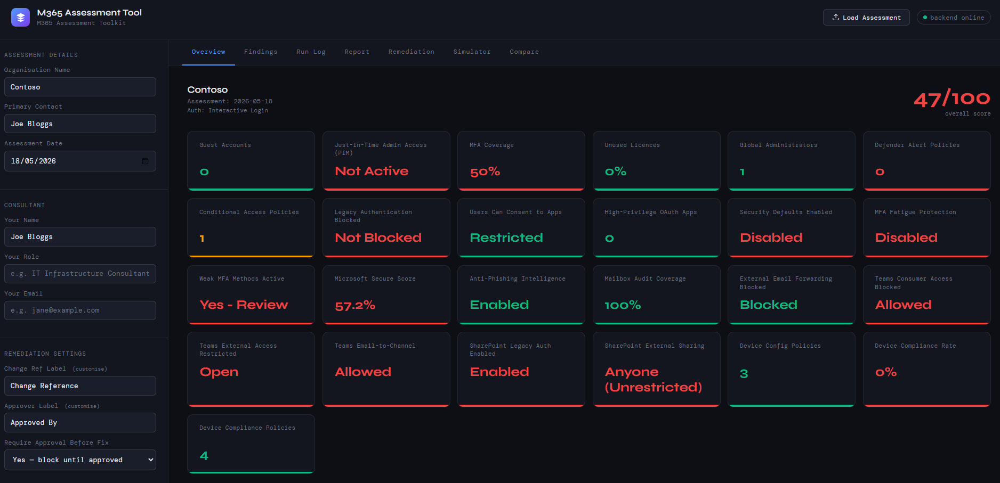
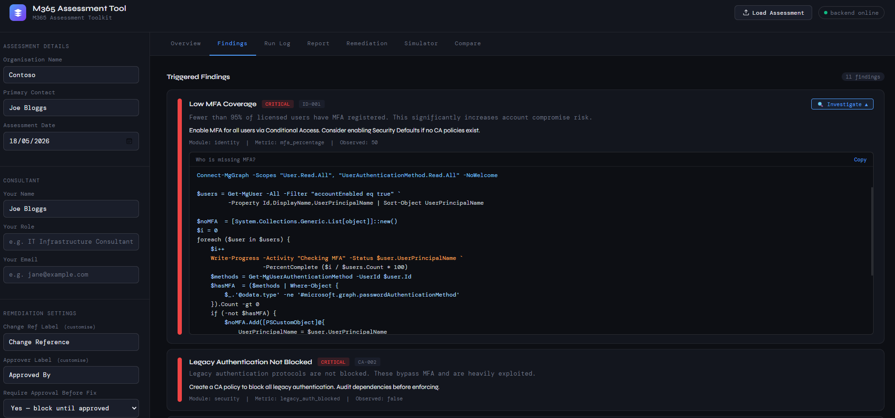
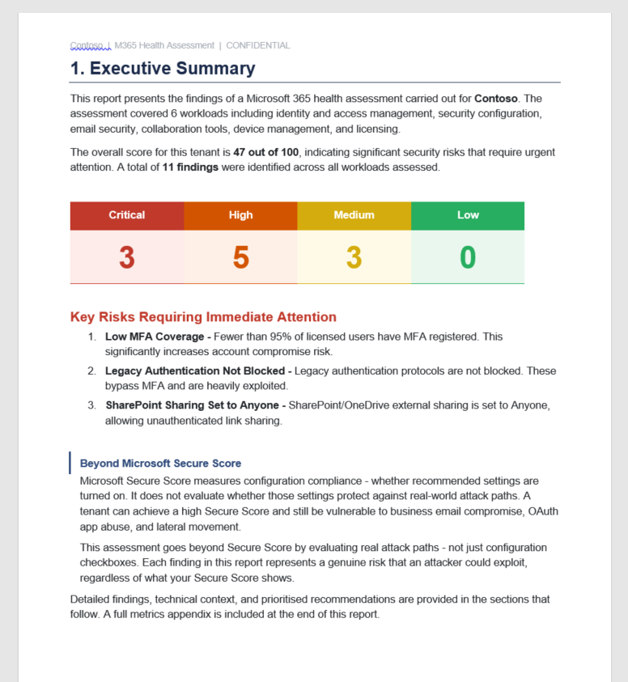
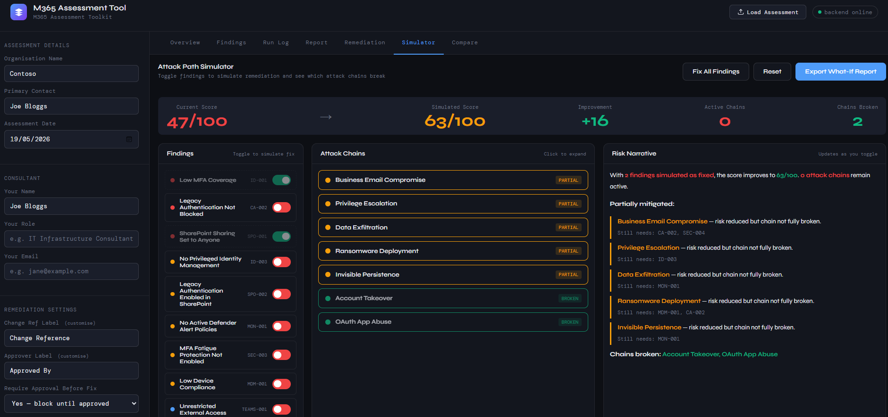

# M365 Assessment Toolkit

A free, open-source Microsoft 365 security assessment tool for IT consultants and administrators. Runs locally on Windows — no data leaves your machine.



## What it does

- Runs a security assessment against any M365 tenant across 6 workloads
- Evaluates 23 findings covering identity, conditional access, Exchange, Teams, SharePoint and Intune
- Scores the tenant based on real attack paths — not just Microsoft Secure Score
- Remediates findings with one click, with full rollback capability
- Produces professional Word reports (Assessment Report, Remediation Report, Comparison Report)
- Simulates attack chains to show which findings enable which attacks
- Compares two assessments to track improvement over time

## What it looks like

### Assessment Dashboard
The dashboard shows a live risk score, colour-coded findings by severity, and module run status. Each finding card explains the risk, the recommended fix, and — for key findings — an inline PowerShell investigation script you can run directly.



### Generated Reports
One click produces a professionally formatted Word document ready to hand to a client. The report covers executive summary, findings detail, risk scoring rationale, and a remediation priority list.



### Attack Simulation
The attack simulation panel maps your open findings to real attack chains — showing exactly which combination of misconfigurations an attacker would exploit, in sequence.



## Quick Install

Open PowerShell as Administrator and run:

```powershell
irm https://raw.githubusercontent.com/malcolmmcdonald1982/m365-assessment-toolkit/main/install.ps1 | iex
```

The installer will check for and install all prerequisites automatically.

## Prerequisites

The installer handles all of these automatically:

| Prerequisite | Version | Purpose |
|---|---|---|
| Python | 3.11+ | Backend server |
| Flask | Latest | Web framework |
| Node.js | 18+ | Report generator |
| docx (npm) | Latest | Word document creation |
| Microsoft.Graph | 2.0+ | Identity, Security, Intune |
| ExchangeOnlineManagement | 3.0+ | Exchange Online |
| MicrosoftTeams | 5.0+ | Microsoft Teams |
| Microsoft.Online.SharePoint.PowerShell | 16.0+ | SharePoint Online |

## Manual Installation

If the one-line installer doesn't work in your environment:

1. Download and extract the zip from the [Releases](../../releases) page
2. Open PowerShell as Administrator in the extracted folder
3. Run `.\install.ps1`

## Authentication

**Interactive Login** — No setup required. The tool prompts for credentials when each module runs. Suitable for one-off assessments.

**App Registration** — Requires setup in Entra ID. Silent authentication for Graph-based modules. Recommended for repeat assessments.

### Setting up App Registration

1. Go to [Entra ID > App registrations](https://entra.microsoft.com/#view/Microsoft_AAD_IAM/ActiveDirectoryMenuBlade/~/RegisteredApps)
2. Click **New registration** — name it `M365 Assessment Toolkit`
3. Copy the **Application (client) ID** and **Directory (tenant) ID**
4. Go to **Certificates & secrets** > **New client secret** — copy the **Value**
5. Go to **API permissions** > **Add a permission** > **Microsoft Graph** > **Application permissions**
6. Add these permissions:

```
User.Read.All
Directory.Read.All
RoleManagement.Read.Directory
UserAuthenticationMethod.Read.All
Reports.Read.All
Policy.Read.All
SecurityEvents.Read.All
Organization.Read.All
Application.Read.All
DeviceManagementManagedDevices.Read.All
DeviceManagementConfiguration.Read.All
AuditLog.Read.All
IdentityRiskyUser.Read.All
```

7. Click **Grant admin consent**

> Exchange, Teams and SharePoint always use interactive login — these PowerShell modules do not support app-only authentication.

## Understanding the Score

The tool's score is **not the same as Microsoft Secure Score**.

| | This Tool | Microsoft Secure Score |
|---|---|---|
| Measures | Real attack path exposure | Configuration compliance |
| A high score means | Low attack surface | Settings follow Microsoft recommendations |
| A low score means | Specific attack paths are open | Some recommended settings are off |

The tool scores 0–100 based on severity-weighted findings:
- **Critical** findings: -8 points each (capped at -32)
- **High** findings: -5 points each (capped at -20)
- **Medium** findings: -3 points each (capped at -12)
- **Low** findings: -1 point each (capped at -4)
- **Floor:** 10 (never shows zero)

A tenant can have a high Microsoft Secure Score and still score poorly here — because Secure Score rewards enabling features, not blocking attack paths.

## Updating

```powershell
irm https://raw.githubusercontent.com/malcolmmcdonald1982/m365-assessment-toolkit/main/update.ps1 | iex
```

Your saved sessions, reports and output files are never touched by the updater.

## Uninstalling

```powershell
irm https://raw.githubusercontent.com/malcolmmcdonald1982/m365-assessment-toolkit/main/uninstall.ps1 | iex
```

The uninstaller offers to back up your saved sessions and reports before removing.

## Data and Privacy

- All data stays on your local machine — nothing is sent to external servers
- Assessment results are saved to `C:\M365 Assessment Toolkit\output\`
- The tool reads tenant data but never writes to it during assessment
- Remediation scripts write to the tenant only when you explicitly click Apply Fix
- Each remediation change is snapshotted before it is made

For client engagements, ensure you have a Data Processing Agreement in place before running assessments against a client tenant.

## Folder Structure

```
C:\M365 Assessment Toolkit\
├── backend.py              # Flask backend
├── index.html              # Frontend (served at localhost:5000)
├── generate-report.js      # Word report generator
├── package.json            # npm dependencies
├── scripts\                # Assessment PowerShell scripts
├── remediation\            # Remediation + rollback scripts
├── output\                 # Sessions, CSVs, remediation logs
└── reports\                # Generated Word documents
```

## Modules

| Module | Tag | Auth | Findings |
|---|---|---|---|
| Identity & MFA | ENTRA | App Reg or Interactive | 5 |
| Security & CA | SEC | App Reg or Interactive | 7 |
| Exchange Online | EXO | Interactive only | 3 |
| Teams | TEAMS | Interactive only | 2 |
| SharePoint | SPO | Interactive only | 2 |
| Intune / Devices | MDM | App Reg or Interactive | 4 |

## Licence

MIT — free to use, modify and distribute. See [LICENSE](LICENSE).

## Disclaimer

This tool is provided as-is for educational and professional use. Always obtain written approval before remediating any tenant. The authors accept no liability for changes made to live environments.
